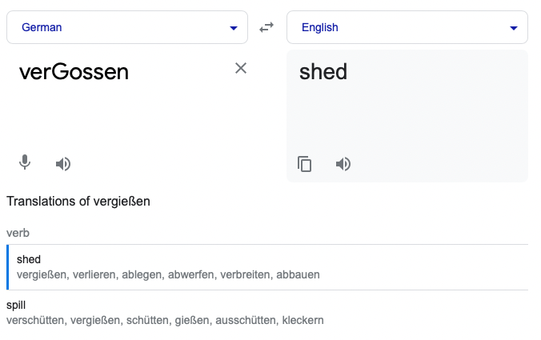

# shed,spill

A tool to pull tweets from Twitter, which is being forgotten.

## Using it

Like everything else about it, Twitter’s developer tooling and APIs are largely incomprehensible. To make this tool work you'll need to register an app on their dev portal and extract a few keys; I’ll walk you through it.

1. Make a copy of the `.env.example` file in this repo and call it `.env`. To do this on the command line: `mv .env.example .env`. This is where we’re going to fill in some information Twitter needs to be queried.
2. Go to [https://developer.twitter.com](https://developer.twitter.com) and sign up if needed.
3. In **Projects & Apps**, click **Add App**, then **Create New**.
4. Choose **Development**.
5. Name it whatever you’d like, but _shed,spill_ would match the repo name.
6. Finish setup. You will be taken to the app’s dashboard.
7. Under **Authentication Tokens** is a section labeled `Access Token and Secret`. It should have a little subhed that says `For @your_twitter_handle`. Click **Generate**.
8. Copy the **API Key** and paste it _inside the quotes_ in the `.env` file you made on the line labeled `CONSUMER_KEY`. It should look like `CONSUMER_KEY="what-you-copied"`.
9. Copy the **API Key Secret** and paste it inside the quotes next to `CONSUMER_SECRET`.
8. Copy the **Access Token** and paste it inside the quotes next to `TOKEN_KEY`.
9. Copy the **Access Token Secret** and paste it inside the quotes next to `TOKEN_SECRET`.
10. [Install Go](https://go.dev/dl/).
11. On the command line, run `go run main.go username`, where `username` is the account you want to download. Do not put an `@` sign. For example, `go run main.go kevboh` would download my lone tweet.

After running, a file named `username.csv` will be present in this folder with all the tweets the tool was able to fetch. Twitter limits access to the most recent 3,200 tweets.

Sorry for all the setup.

## Errata

Name:

## License

See [LICENSE.md](./LICENSE.md). You can view the license’s history [here](https://git.sr.ht/~boringcactus/fafol/tree/master/LICENSE.md).
